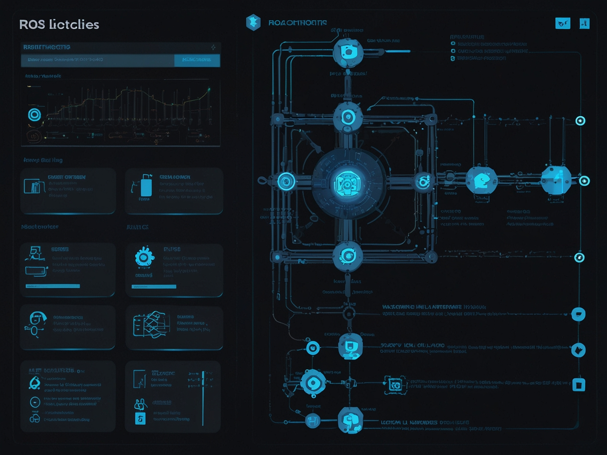
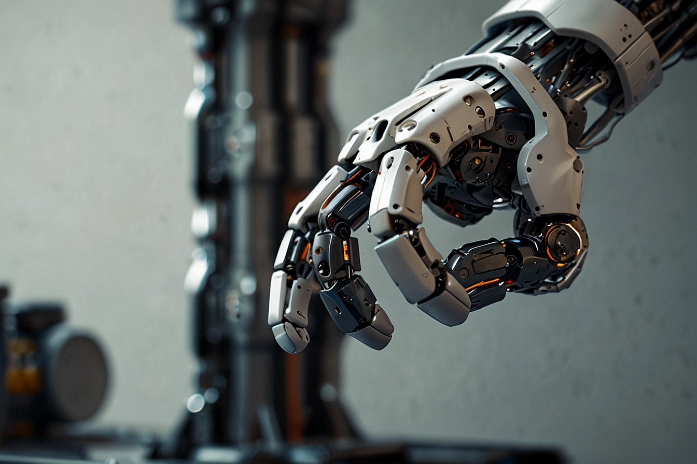

# Chapter 1: ROS 2 Architecture & Nodes

## Learning Objectives

By the end of this chapter, students will be able to:
- Understand the fundamental architecture of Robot Operating System 2 (ROS 2)
- Implement basic ROS 2 nodes in Python using rclpy
- Explain the differences between ROS 1 and ROS 2 architectures
- Design node structures for humanoid robotics applications

## Overview

The Robot Operating System 2 (ROS 2) serves as the foundational nervous system for humanoid robotics, providing a flexible framework for writing robot software. This chapter explores the architecture of ROS 2 and how nodes form the basic building blocks of robotic applications.

## Table of Contents
1. [ROS 2 Fundamentals](./ros2-fundamentals)
2. [Nodes Architecture](./nodes-architecture)
3. [Practical Exercises](./practical-exercises)

## Introduction to ROS 2

ROS 2 is the next generation of the Robot Operating System, designed to address the limitations of ROS 1 and provide a more robust, secure, and scalable framework for robotics development. The architecture of ROS 2 is built on the Data Distribution Service (DDS) standard, which enables real-time, high-performance communication between different components of a robotic system.

### Key Architectural Components:

1. **Nodes**: The fundamental unit of computation in ROS 2
2. **DDS Middleware**: Handles message passing between nodes
3. **Packages**: Organize code, data, and configuration files
4. **Launch Files**: Start multiple nodes simultaneously
5. **Tools**: Command-line utilities for introspection and debugging

In the context of humanoid robotics, ROS 2 nodes can represent various subsystems such as joint controllers, perception systems, planning modules, and high-level behaviors. The distributed nature of ROS 2 allows these components to run on different hardware platforms while maintaining seamless communication.

## Next Steps

In the next section, we'll explore the fundamentals of ROS 2 in more detail, including the differences from ROS 1 and the benefits of the DDS-based architecture.