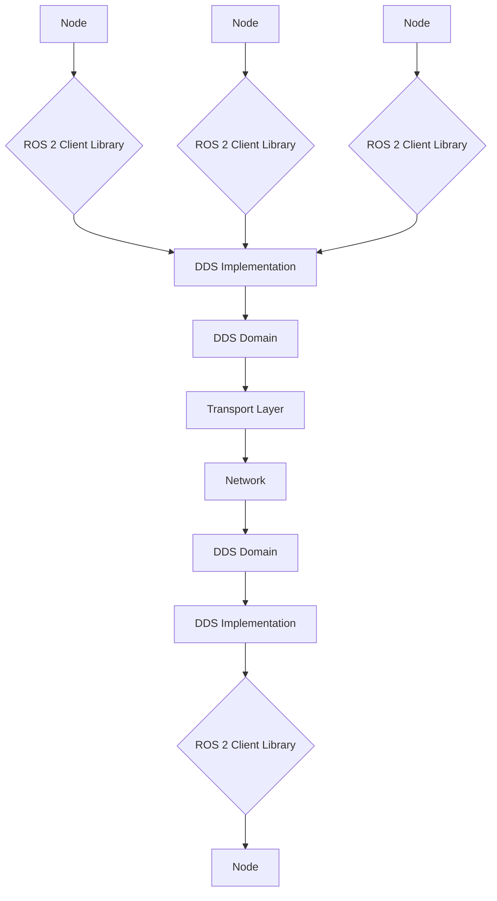

# Chapter 3 — Deep-Dive Theory

## Advanced ROS 2 Architecture

### DDS (Data Distribution Service) Foundation

ROS 2 is built on top of DDS (Data Distribution Service), a middleware standard for real-time systems. Understanding DDS is crucial for mastering ROS 2 architecture.

DDS provides a standardized API for machine-to-machine communication in distributed systems. It enables:

- **Data-centricity**: Data is king; the system is built around the data being shared rather than around the applications that produce or consume it.
- **Strong typing**: Type-safe interfaces to ensure type checking occurs at compile time rather than runtime.
- **Language independence**: Applications written in C++, Java, C#, or Python can interoperate transparently.
- **Transport independence**: Data transport can occur via shared memory, TCP, UDP, or other mechanisms without requiring application changes.

### Quality of Service (QoS) Profiles

ROS 2 offers several QoS settings to guarantee delivery and performance characteristics:

- **Reliability**: Controls message delivery guarantees (RELIABLE or BEST_EFFORT)
- **Durability**: Determines how messages are handled for late-joining subscribers (VOLATILE or TRANSIENT_LOCAL)
- **History**: Controls how messages are stored (KEEP_LAST or KEEP_ALL)
- **Depth**: Specifies the size of the message queue when history policy is KEEP_LAST
- **Deadline**: The maximum duration between consecutive messages of the same topic
- **Liveliness**: How the publisher's availability is determined
- **Lifespan**: Maximum duration before a published message is dropped from the topic
- **Matched**: Defines what to do when publishers and subscribers come online or go offline

### ROS 2 Communication Architecture



### ROS 2 Execution Model

ROS 2 uses a multi-threaded execution model with executors that can handle multiple nodes or multiple callbacks from a single node. The two main executor types are:

- **Single-threaded executor**: Executes all callbacks in the same thread.
- **Multi-threaded executor**: Distributes callback execution across multiple threads, potentially executing more than one callback concurrently.

## Advanced Node Concepts

### Composition and Nodelets

Unlike ROS 1, ROS 2 encourages composition of nodes within the same process to reduce communication overhead. This is achieved through "components" that can be loaded into a "container" process.

```cpp
// Example of a simple ROS 2 component
#include "rclcpp/rclcpp.hpp"

class MinimalComponent : public rclcpp::Node
{
public:
  explicit MinimalComponent(const rclcpp::NodeOptions & options)
  : Node("minimal_component", options)
  {
    // Component implementation
  }
};

#include "rclcpp_components/register_node_macro.hpp"

// Register the component
RCLCPP_COMPONENTS_REGISTER_NODE(MinimalComponent)
```

### Lifecycle Nodes

Lifecycle nodes provide a standard way to manage the state of complex systems with multiple operational states:

- **Unconfigured**: The node is initialized but not yet configured
- **Inactive**: The node is configured but not yet activated
- **Active**: The node is fully operational
- **Finalized**: The node has been shut down

```python
import rclpy
from rclpy.lifecycle import LifecycleNode, TransitionCallbackReturn
from rclpy.lifecycle import State

class LifecycleTalker(LifecycleNode):
    def __init__(self):
        super().__init__('lifecycle_talker')
        self.timer = None

    def on_configure(self, state: State) -> TransitionCallbackReturn:
        # Configuration code here
        return TransitionCallbackReturn.SUCCESS

    def on_activate(self, state: State) -> TransitionCallbackReturn:
        # Activation code here
        return TransitionCallbackReturn.SUCCESS

    def on_deactivate(self, state: State) -> TransitionCallbackReturn:
        # Deactivation code here
        return TransitionCallbackReturn.SUCCESS

    def on_cleanup(self, state: State) -> TransitionCallbackReturn:
        # Cleanup code here
        return TransitionCallbackReturn.SUCCESS
```

## Advanced Communication Patterns

### Services vs Actions

While both services and actions handle request-response patterns, they differ significantly:

- **Services**: Best for synchronous, quick operations that typically complete within seconds.
- **Actions**: Designed for long-running tasks that may take minutes or hours, with built-in feedback mechanisms.

### Custom Message Types

Creating custom messages in ROS 2 involves defining `.msg` files in your package's `msg` directory:

```
# Custom message definition: PoseWithCovariance.msg
geometry_msgs/Pose pose
float64[36] covariance
std_msgs/Header header
```

### Introspection and Debugging Tools

ROS 2 provides powerful tools for system introspection:

- `ros2 topic echo <topic_name>` - Display messages published to a topic
- `ros2 service call <service_name> <service_type> <arguments>` - Call a service with arguments
- `ros2 action send_goal <action_name> <action_type> <goal_arguments>` - Send a goal to an action server
- `ros2 node info <node_name>` - Display information about a node
- `ros2 lifecycle list <node_name>` - List lifecycle states of a node

## Performance Considerations

### Memory Management

ROS 2 uses a copy-based message passing approach by default, which can be memory-intensive. For high-performance applications:

- Use intraprocess communication when nodes are in the same process
- Consider using shared memory for large data transfers
- Implement custom allocators for performance-critical applications

### Real-time Considerations

For real-time applications with ROS 2:

1. Use real-time capable DDS implementations (e.g., RTI Connext)
2. Configure appropriate QoS policies for deterministic behavior
3. Consider using real-time Linux kernel with PREEMPT_RT patches
4. Profile application timing with tools like `tracetools`

## Security in ROS 2

ROS 2 includes security features based on DDS Security standard:

- **Authentication**: Verify the identity of peers in the system
- **Access Control**: Define what resources each participant can access
- **Encryption**: Encrypt data in transit and at rest

## ROS 2 Ecosystem

### Available Distributions

ROS 2 follows a time-based release schedule with distributions named alphabetically:

- **Foxy Fitzroy** (June 2020) - Current Tier 1 support until May 2025
- **Galactic Geochelone** (May 2021) - Tier 2 support
- **Humble Hawksbill** (May 2022) - Current LTS, Tier 1 support until May 2027
- **Iron Irwini** (May 2023) - Current Tier 1 support until November 2024
- **Jazzy Jalisco** (May 2024) - Current Tier 1 support until May 2025 (Planned)

### Migration from ROS 1

While ROS 2 is not backward compatible with ROS 1, tools are available to ease the transition:

- **ros1_bridge**: Allows ROS 1 and ROS 2 nodes to communicate
- **Mentor packages**: Reimplementations of common ROS 1 functionality in ROS 2
- **Migration guides**: Detailed instructions for converting packages

## Future Directions

ROS 2 continues to evolve with focus on:

- **Real-time performance**: Enhanced real-time capabilities
- **Security**: Improved security implementations
- **Interoperability**: Better integration with other robotic frameworks
- **Cloud robotics**: Enhanced support for cloud-based robotics applications
- **AI/ML integration**: Better integration with machine learning frameworks

## Summary

This deep-dive chapter has explored the advanced concepts underlying ROS 2 architecture. Understanding these concepts is essential for developing robust, efficient, and scalable robotic applications. The DDS foundation, QoS policies, and advanced node concepts form the backbone of modern ROS 2 applications.

In the next chapters, we'll apply these theoretical concepts in practical lab exercises and simulations.