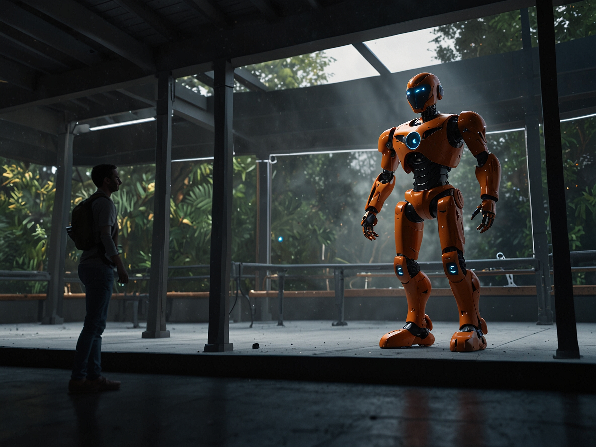

# Chapter 1: Gazebo Physics Simulation

## Learning Objectives

By the end of this chapter, students will be able to:
- Configure and run physics simulations in Gazebo for humanoid robots
- Tune physics parameters for realistic robot behavior
- Integrate Gazebo with ROS 2 for sensor simulation
- Develop simulation environments for humanoid robotics testing

## Overview

Gazebo provides a powerful physics simulation environment that enables the development and testing of humanoid robots in a safe, cost-effective, and reproducible manner. This chapter explores the capabilities of Gazebo for simulating humanoid robots, including physics modeling, sensor simulation, and environment creation.

## Table of Contents
1. [Physics Engines](./physics-engines)
2. [Simulation Setup](./simulation-setup)
3. [Practical Exercises](./practical-exercises)

## Introduction to Gazebo for Humanoid Robotics

Gazebo is a 3D simulation environment that provides realistic physics simulation, high-quality graphics rendering, and convenient programmatic interfaces. For humanoid robotics, Gazebo enables researchers and engineers to:

- Test robot behaviors without risk of physical damage
- Evaluate control algorithms before deployment on hardware
- Generate synthetic training data for machine learning models
- Prototype complex interactions with environments and objects

The simulation of humanoid robots presents unique challenges compared to simpler robots, including:
- Complex kinematic structures with many degrees of freedom
- Dynamic balance and locomotion requirements
- Detailed interaction with environments and objects
- Accurate modeling of contacts and friction

## Next Steps

In the following sections, we'll explore the physics engines available in Gazebo and learn how to set up realistic simulations for humanoid robots.