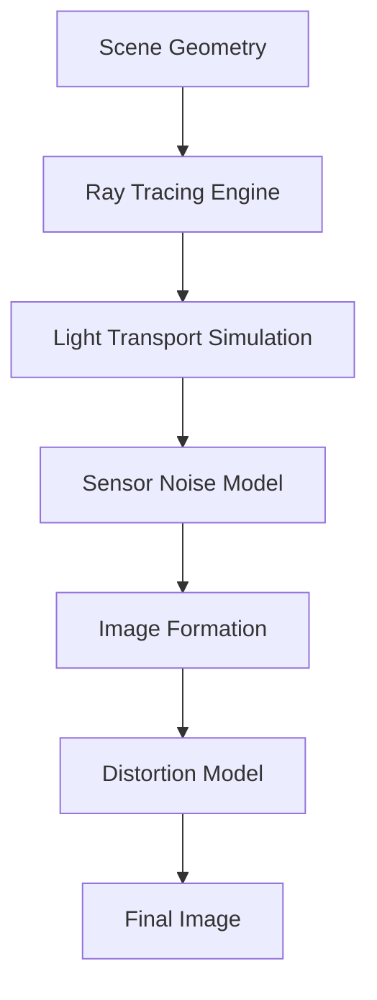

# Chapter 5 — Simulation

## Advanced Simulation Techniques for Digital Twins

Simulation is the cornerstone of digital twin technology in robotics, enabling the creation of virtual replicas that accurately model the behavior of physical systems. This chapter explores advanced simulation techniques that maximize the utility of digital twins while managing the inherent trade-offs between computational efficiency and simulation fidelity.

## Physics Simulation Approaches

### Rigid Body Dynamics

Rigid body simulation is fundamental to most robotics applications, modeling objects as non-deformable entities with fixed geometric relationships between their points. The accuracy of rigid body simulation is determined by several factors:

**Integration Methods:**
- **Explicit Euler**: Computationally efficient but requires small timesteps for stability
- **Semi-implicit Euler**: More stable than explicit Euler, allowing for larger timesteps
- **Runge-Kutta (RK4)**: More accurate but computationally expensive
- **Verlet Integration**: Energy-conserving with good stability for collision response

In practice, most robotics simulators use a combination of these approaches, often selecting methods based on the required balance of accuracy, stability, and performance. For humanoid robots with complex dynamics, semi-implicit Euler or higher-order methods like RK4 are often preferred for their stability with reasonable computational cost.

### Multi-Body Systems

Humanoid robots consist of multiple interconnected rigid bodies connected by joints. The dynamics of these systems are governed by the Lagrangian formulation:

```
M(q)q̈ + C(q, q̇)q̇ + g(q) = τ + J^T f
```

Where:
- M(q) is the mass matrix
- C(q, q̇) represents Coriolis and centrifugal forces
- g(q) represents gravitational forces
- τ represents joint torques
- J is the Jacobian matrix
- f represents external forces

Accurate simulation of such systems requires careful handling of constraint equations, particularly for closed-loop kinematic chains common in humanoid robots.

### Contact and Collision Modeling

Contact mechanics are critical for robotics simulation, especially for locomotion and manipulation tasks. Two main approaches are used:

**Penalty Methods:**
- Apply forces proportional to interpenetration depth
- Computationally efficient but may exhibit unrealistic interpenetration
- Suitable for soft contacts and less demanding applications

**Constraint-Based Methods:**
- Formulate contacts as mathematical constraints
- Prevent interpenetration but require solving complex optimization problems
- More accurate but computationally demanding

For humanoid robots, a hybrid approach often works well, using constraint-based methods for critical contacts (e.g., feet during walking) and penalty methods for less critical interactions.

## Sensor Simulation Techniques

### Camera Simulation

Camera simulation in robotics involves modeling both geometric and photometric properties:

**Geometric Modeling:**
- Intrinsic parameters: focal length, principal points, distortion coefficients
- Extrinsics: position and orientation relative to the robot base
- Field of view and resolution settings

**Photometric Modeling:**
- Lighting conditions and their impact on scene appearance
- Noise models: Gaussian noise, Poisson noise, fixed pattern noise
- Exposure effects and dynamic range limitations

**Advanced Camera Simulation:**
- Depth cameras with realistic noise patterns
- Thermal cameras for heat signature simulation
- Event cameras for high-speed visual information



### LIDAR Simulation

LIDAR sensors are simulated by casting rays from the sensor origin and computing distances to the nearest intersections with scene geometry:

**Ray Casting Algorithm:**
1. Generate rays based on the LIDAR's angular resolution and field of view
2. For each ray, compute intersection with scene geometry
3. Apply sensor noise model to simulated measurements
4. Account for sensor limitations (range, resolution, accuracy)

**Advanced LIDAR Simulation:**
- Multi-echo LIDAR for handling transparent or partially reflective surfaces
- Intensity modeling based on surface reflectivity
- Motion distortion effects for moving platforms
- Atmospheric effects (for outdoor applications)

### IMU and Inertial Sensor Simulation

Inertial sensors provide crucial information for robot state estimation and are simulated by computing:

**Linear Acceleration:**
- The second time derivative of position plus gravity compensation
- Noise modeling including bias, drift, and random walk components
- Cross-axis sensitivity and scale factor errors

**Angular Velocity:**
- The first time derivative of orientation
- Gyro-specific noise characteristics and drift

**Advanced IMU Simulation:**
- Temperature effects on sensor readings
- Vibration-induced errors
- Magnetometer modeling for orientation reference
- Sensor mounting errors and misalignments

## Real-Time Simulation Concepts

### Fixed-Step vs. Variable-Step Simulation

**Fixed-Step Simulation:**
- Executes physics updates at regular intervals
- Deterministic behavior, essential for reproducible experiments
- Synchronization with real-time control systems
- Potential stability issues with stiff systems

**Variable-Step Simulation:**
- Adjusts timestep based on system dynamics
- More efficient for systems with varying time scales
- Reduced determinism, complicating real-time applications
- Better handling of stiff systems

For robotics applications, fixed-step simulation is typically preferred to maintain deterministic behavior and synchronicity with real-time control systems.

### Parallel Simulation Techniques

To achieve high-performance simulation, several parallelization strategies are employed:

**Spatial Decomposition:**
- Divide simulation space into regions processed in parallel
- Efficient for large environments with limited object interaction
- Requires careful handling of boundary conditions

**Multi-Body Decomposition:**
- Process different robots or subsystems in parallel
- Effective for multi-robot scenarios
- Communication overhead for interacting systems

**Pipeline Parallelization:**
- Parallelize different simulation phases (physics, rendering, control)
- Overlap computation with communication
- Requires careful synchronization to maintain consistency

## Simulation Fidelity vs. Performance Trade-offs

### The Fidelity-Performance Continuum

Simulation fidelity can be adjusted along multiple dimensions to balance accuracy with computational efficiency:

**Low Fidelity (Fast Simulation):**
- Simplified collision geometries (bounding boxes instead of detailed meshes)
- Reduced physics update rates
- Coarse-grained collision detection
- Simplified sensor models

**Medium Fidelity (Balanced Simulation):**
- Convex hull collision geometries
- Moderate physics update rates (2-5ms timesteps)
- Standard sensor noise models
- Reasonable material properties

**High Fidelity (Accurate Simulation):**
- Detailed triangular meshes for collisions
- High physics update rates (1ms timesteps)
- Advanced material simulations (friction, restitution, compliance)
- Sophisticated sensor models with realistic noise and error characteristics

### Level of Detail (LOD) Strategies

LOD techniques dynamically adjust simulation detail based on relevance:

**Geometric LOD:**
- Use simpler collision meshes for distant or less critical objects
- Switch representations based on distance or importance

**Physics LOD:**
- Reduce physics complexity for objects not in focus
- Use simplified dynamics models (e.g., point masses instead of full rigid body models)

**Sensor LOD:**
- Adjust sensor resolution based on distance to objects of interest
- Reduce sensor update rates for background elements

## Domain Randomization for Sim-to-Real Transfer

### Visual Domain Randomization

Visual domain randomization improves sim-to-real transfer by training models with randomized visual properties:

**Techniques:**
- Randomize lighting conditions and positions
- Vary textures, colors, and material properties
- Adjust camera properties (resolution, noise, distortion)
- Randomize backgrounds and environmental elements

### Dynamics Domain Randomization

Dynamics domain randomization addresses discrepancies in physical behavior:

**Parameters to Randomize:**
- Mass properties of objects and robot links
- Friction coefficients (static and dynamic)
- Damping parameters
- Actuator delay and noise characteristics
- Joint stiffness and backlash

### Systematic Approach to Domain Randomization

1. **Identify Critical Parameters:** Determine which simulation parameters most affect task performance
2. **Define Randomization Ranges:** Establish realistic bounds for parameter variation
3. **Validate Randomization:** Ensure randomization doesn't make the task impossible
4. **Monitor Training:** Track performance across different randomization settings

## Hardware-in-the-Loop (HIL) Simulation

### HIL Architecture

Hardware-in-the-Loop simulation integrates real hardware components with simulated environments:

```
┌─────────────────┐    ┌─────────────────┐    ┌─────────────────┐
│   Real Robot   │◄──►│  Communication  │◄──►│  Simulation     │
│   Components   │    │   Layer (ROS)   │    │   Environment   │
└─────────────────┘    └─────────────────┘    └─────────────────┘
        │                       │                       │
        ▼                       ▼                       ▼
┌─────────────────┐    ┌─────────────────┐    ┌─────────────────┐
│  Real Sensors  │    │   Message       │    │  Simulated      │
│  & Actuators   │    │   Handling      │    │  Environments   │
└─────────────────┘    └─────────────────┘    └─────────────────┘
```

### Applications of HIL Simulation

**Sensor Validation:**
- Test sensor behavior in controlled environments
- Validate sensor fusion algorithms
- Characterize sensor performance under various conditions

**Controller Development:**
- Test control algorithms with real hardware dynamics
- Validate control stability and performance
- Calibrate controller parameters

**System Integration:**
- Validate entire system performance
- Test safety mechanisms
- Evaluate system robustness

## Advanced Simulation Environments

### NVIDIA Isaac Sim

NVIDIA Isaac Sim provides advanced capabilities for robotics simulation:

**Photorealistic Rendering:**
- High-fidelity visual simulation using RTX ray tracing
- Accurate light transport for computer vision applications
- Support for physically-based materials

**Synthetic Data Generation:**
- Automatic generation of ground-truth annotations
- Domain randomization tools
- Multi-camera synchronized capture

**Integration:**
- Direct integration with Isaac ROS packages
- Support for complex robotic systems
- Cloud deployment capabilities

### Unity Simulation

Unity provides a platform for high-fidelity visual simulation:

**Graphics Capabilities:**
- HDRP (High Definition Render Pipeline) for photorealism
- Advanced lighting systems (global illumination, real-time ray tracing)
- Material authoring tools

**Robotics Integration:**
- Unity Robotics packages for ROS communication
- ML-Agents for reinforcement learning
- XR support for VR/AR interaction

### Custom Simulation Platforms

For specialized applications, custom simulation platforms may be necessary:

**Requirements:**
- Specific physics modeling requirements
- Novel sensor simulation needs
- Specialized performance requirements
- Integration with proprietary hardware

## Validation and Verification of Simulation

### Simulation Validation Frameworks

Validating simulation accuracy requires systematic comparison between simulated and real behavior:

**Kinematic Validation:**
- Compare position and orientation trajectories
- Analyze forward kinematics accuracy
- Validate workspace calculations

**Dynamic Validation:**
- Compare simulated and measured forces/torques
- Analyze dynamic response to control inputs
- Validate system identification results

**Sensor Validation:**
- Compare sensor outputs under identical conditions
- Analyze noise characteristics
- Validate sensor calibration procedures

### Quantitative Validation Metrics

**Position Error Metrics:**
- Root Mean Square Error (RMSE) for trajectory comparison
- Maximum deviation error
- Statistical analysis of error distribution

**Timing Metrics:**
- Phase comparison using cross-correlation
- Group delay analysis
- Stability assessment over extended periods

**Qualitative Assessment:**
- Visual comparison of motion patterns
- Expert evaluation of behavior plausibility
- Task performance comparisons

## Simulation Optimization Techniques

### Performance Profiling

Understanding simulation bottlenecks is essential for optimization:

**Physics Profiling:**
- Identify computationally expensive collision pairs
- Analyze constraint solving efficiency
- Evaluate integration method performance

**Rendering Profiling:**
- Monitor frame rates and rendering times
- Analyze draw call efficiency
- Evaluate texture and shader performance

### Computational Optimization

**Algorithm Optimization:**
- Use efficient collision detection algorithms
- Implement spatial partitioning techniques
- Optimize constraint solving methods

**Hardware Optimization:**
- Leverage multi-core processors for parallelization
- Use GPU acceleration for physics and rendering
- Optimize memory access patterns

## Future Directions in Simulation Technology

### AI-Enhanced Simulation

**Neural Physics Simulation:**
- Learning-based approaches to physics modeling
- Accelerating simulation with neural networks
- Modeling complex phenomena difficult to simulate with traditional methods

**Learned Simulation:**
- Using ML to improve simulation accuracy
- Learning error models for better sim-to-real transfer
- Adaptive simulation based on system behavior

### Cloud-Based Simulation

**Scalability:**
- Access to high-performance computing resources
- Parallel simulation of multiple scenarios
- Distributed execution for large-scale testing

**Collaboration:**
- Shared simulation environments
- Multi-user access and editing
- Version control for simulation assets

### Integration with Digital Manufacturing

**CAD Integration:**
- Direct import of manufacturing models
- Validation against manufactured tolerances
- Integration with product lifecycle management

## Assessment and Application

### Simulation Design Exercise

Design a simulation environment for a 6-DOF robotic manipulator that includes:
1. A realistic physics model with appropriate constraints
2. Accurate sensor simulation (camera, joint encoders, force/torque sensors)
3. Performance optimization strategies to maintain real-time operation
4. Validation procedures to verify simulation accuracy

### Implementation Considerations

When implementing the simulation:
- Define clear interfaces between simulation components
- Implement proper logging and visualization tools
- Plan for extensibility to accommodate future requirements
- Establish protocols for simulation parameter tuning and validation

## Summary

Advanced simulation techniques for digital twins require a careful balance between accuracy and computational efficiency. Effective simulation systems must model complex physical interactions, sensor behaviors, and environmental conditions while maintaining the performance necessary for real-time operation or accelerated training.

Understanding the various approaches to physics simulation, sensor modeling, and performance optimization is crucial for developing effective digital twins that can accelerate robotics development while ensuring successful transfer to real-world applications. As simulation technology continues to advance, particularly with AI integration and cloud computing, the capabilities and fidelity of digital twins will continue to improve, enabling increasingly sophisticated robotics applications.