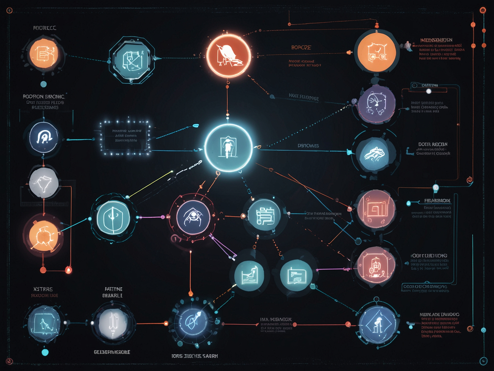

# Chapter 1: OpenAI Whisper Voice-to-Action

## Learning Objectives

By the end of this chapter, students will be able to:
- Integrate OpenAI Whisper for robust speech recognition in robotics
- Create voice-to-action pipelines for humanoid robots
- Process natural language commands for robot control
- Implement error handling for speech recognition systems

## Overview

Voice interaction is a critical component of human-robot interaction, particularly for humanoid robots that are designed to work alongside humans. OpenAI Whisper provides state-of-the-art speech recognition capabilities that can be leveraged to create sophisticated voice-to-action systems for humanoid robots. This chapter explores how to integrate Whisper into the robotic control pipeline.

## Table of Contents
1. [Whisper Integration](./whisper-integration)
2. [Voice-to-Action Pipeline](./voice-to-action-pipeline)
3. [Practical Exercises](./practical-exercises)

## Introduction to Voice Interaction in Humanoid Robotics

Voice communication provides a natural and intuitive way for humans to interact with humanoid robots. By leveraging OpenAI Whisper, we can create systems that:

- Understand spoken commands with high accuracy
- Convert natural language to robot actions
- Handle ambiguous or complex instructions
- Provide voice feedback to users

For humanoid robots, voice-to-action systems need to handle the complexity of physical tasks, such as:
- Navigation and path planning
- Object manipulation and grasping
- Social interaction and communication
- Task execution and monitoring

The integration of Whisper with ROS 2 creates a powerful platform for voice-controlled humanoid robots, enabling complex behaviors to be triggered through natural language commands.

## Next Steps

In the following sections, we'll explore how to integrate Whisper into robotics systems and build voice-to-action pipelines for humanoid robots.